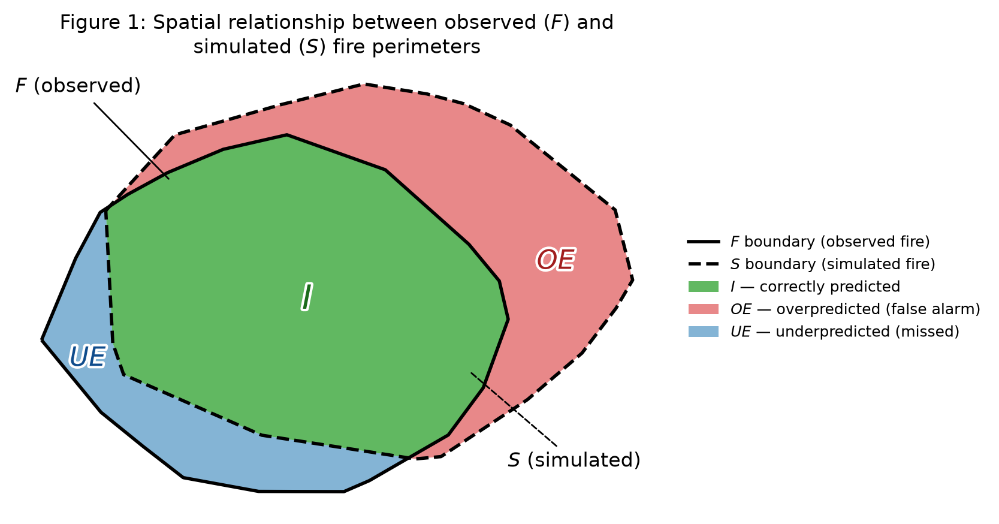

# Fire Spread Indices

Here is a concise list of metrics used to evaluate wildfire spread simulations, categorized by their focus.

The metrics use the notation from Figure 1:

* $F$: Reference / Observed fire area ($F = I + UE$)
* $S$: Simulated / Predicted fire area ($S = I + OE$)
* $I$: Intersection area (Correctly predicted fire)
* $OE$: Overestimated area (False alarms / Overprediction)
* $UE$: Underestimated area (Missed fire / Underprediction)



---

### 1. Overall Agreement Metrics (Overall Performance)

#### 1.1 Jaccard’s Coefficient / Intersection over Union (IoU)
* **Formula**: $\frac{I}{I + OE + UE} = \frac{I}{S \cup F}$
* **Description**: Measures the ratio of overlapping burned area to the total combined area of predicted and observed fires.
* **Best use**: The default headline metric for benchmarking and ranking fire spread simulators (e.g., FARSITE, ELMFIRE, WRF-Fire, cellular-automata/ML emulators) against a reference perimeter, since it penalizes both over- and under-prediction symmetrically and is widely reported in the fire-modeling literature, making cross-study comparison easier.


#### 1.2 Sørensen’s Similarity Index / $F_1$ Score / Sørensen-Dice Coefficient
* **Formula**: $\frac{2I}{F + S} = \frac{2I}{2I + OE + UE}$
* **Description**: Measures spatial overlap similarity, weighting the intersection twice as heavily as Jaccard's coefficient.
* **Best use**: Preferred over IoU when aggregating skill scores across many fires of varying size (e.g., a validation suite spanning small prescribed burns to large megafires), since its higher sensitivity to the intersection term makes it less harshly punishing on small fires where a few misaligned pixels would tank IoU.


#### 1.3 Shape Deviation Index (SDI)
* **Formula**: $\frac{OE + UE}{F} = \frac{OE + UE}{I + UE}$
* **Description**: Measures the total error area relative to the total observed fire size. Smaller values are better (ideal is 0).
* **Best use**: Useful for comparing model error consistency across fires of very different sizes (e.g., a 50 ha prescribed burn vs. a 50,000 ha wildfire), because normalizing by the observed area $F$ keeps the score scale-independent, unlike raw error area.


#### 1.4 Area Difference Index (ADI)
* **Formula**: $\frac{OE + UE}{I}$
* **Description**: Measures the total error relative to the correctly predicted area. Highly sensitive to poor overlaps where $I$ is very small.
* **Best use**: A diagnostic "stress test" for simulation failure modes — e.g., a bad ignition point, incorrect early wind forcing, or a missed spotting event that causes the simulated and observed perimeters to barely overlap. Because it blows up as $I \to 0$, it flags catastrophic misalignments that SDI or IoU would report as merely "poor" rather than "broken."


#### 1.5 Structural Similarity Index (SSIM)
* **Formula**: $\text{SSIM}(F, S) = [l(F, S)]^\alpha \cdot [c(F, S)]^\beta \cdot [s(F, S)]^\gamma$
* **Description**: Evaluates the spatial texture, structural patterns, and continuous field distribution (e.g., rate of spread or fire intensity) between prediction and observation.
* **Best use**: For comparing continuous raster fields rather than binary burned/unburned masks — e.g., simulated vs. satellite-derived fire arrival-time isochrones (VIIRS/MODIS active-fire detection times), or simulated rate-of-spread/fire-intensity grids against observed fire radiative power, where local texture and gradient patterns (fingering, spotting-driven patchiness) matter as much as overall area agreement.
* **How it works**: Computed in local sliding windows (not globally), then averaged, so it's sensitive to *where* patterns sit, not just aggregate stats. Each window compares three things independently: luminance $l$ (do local means agree — e.g., is simulated ROS as fast as observed in this neighborhood?), contrast $c$ (do local variances agree — sharp fronts vs. an over-smoothed field), and structure $s$ (do local spatial patterns correlate — do fingering/spotting patches line up in the same places?). Two fields with identical mean and variance but shuffled spatial patterns still score low. Ranges from $-1$ (anti-correlated) to $1$ (structurally identical); $0$ means no structural relationship. In [`fsi_metrics.py`](fsi_metrics.py), the stabilizing constants $C_1, C_2$ scale off a `data_range` that's auto-computed per fire pair unless passed explicitly — fix it manually when scoring a batch of fires so SSIM values stay comparable across the set.


---

### 2. Overprediction / Specificity Metrics

#### 2.1 Precision / Positive Predictive Value (PPV)
* **Formula**: $\frac{I}{S} = \frac{I}{I + OE}$
* **Description**: The proportion of the predicted fire area that actually burned. High precision means low overprediction.
* **Best use**: Relevant when false alarms carry a real operational cost — e.g., evaluating a simulation used to place containment lines, allocate suppression resources, or trigger evacuation orders, where predicting fire in areas that never actually burn wastes firefighting resources or causes unnecessary evacuations.


#### 2.2 Partial SDI Over ($SDI_{over}$)
* **Formula**: $\frac{OE}{F} = \frac{OE}{I + UE}$
* **Description**: Isolates the overpredicted area relative to the observed fire size.
* **Best use**: Useful for tracking a model's overprediction bias across a fire season or multiple case studies (e.g., diagnosing a systematic wind-driven-spread bias in a spread model), since normalizing by observed area $F$ allows comparison across fires of different sizes.


#### 2.3 Partial ADI Over ($ADI_{over}$)
* **Formula**: $\frac{OE}{I}$
* **Description**: Measures overprediction relative to the correctly matched fire area.
* **Best use**: Diagnosing "runaway" simulations where the model correctly ignites and grows a fire but then spreads it far beyond the true perimeter (e.g., due to underestimated fuel moisture or overestimated wind speed) — the ratio to $I$ rather than $F$ makes it especially sensitive to cases where overprediction dwarfs the correctly matched core.


#### 2.4 Fire Area Ratio / Expansion Ratio
* **Formula**: $\frac{S}{F} = \frac{I + OE}{I + UE}$
* **Description**: A macro-scale ratio of total simulated area to total observed area. Values $> 1$ indicate overprediction; values $< 1$ indicate underprediction.
* **Best use**: A quick, spatially-agnostic sanity check for total burned-area budgeting — e.g., comparing a simulator's seasonal or regional total burned area against official incident reports (InciWeb, NIFC) or burned-area products (MTBS), without needing perimeter geometry at all.


---

### 3. Underprediction / Sensitivity Metrics

#### 3.1 Recall / True Positive Rate (TPR) / Sensitivity
* **Formula**: $\frac{I}{F} = \frac{I}{I + UE}$
* **Description**: The proportion of the actual burned area successfully captured by the model. High recall means low underprediction.
* **Best use**: Critical when missed fire spread is the dangerous failure mode — e.g., validating early-warning or real-time fire-spread forecast systems used for public evacuation decisions, where failing to predict fire reaching a community (underprediction) is far costlier than a false alarm.


#### 3.2 Partial SDI Under ($SDI_{under}$)
* **Formula**: $\frac{UE}{F} = \frac{UE}{I + UE}$
* **Description**: Isolates the missed (underpredicted) area relative to the observed fire size.
* **Best use**: Tracking systematic underprediction bias across cases — e.g., a spread model that consistently fails to capture spotting-driven spread ahead of the main fire front — normalized so results are comparable across small and large fires.


#### 3.3 Partial ADI Under ($ADI_{under}$)
* **Formula**: $\frac{UE}{I}$
* **Description**: Measures underprediction relative to the correctly matched fire area.
* **Best use**: Flagging cases where a simulation captures only a small, conservative "core" of the true fire and misses large portions of actual spread (e.g., a fire that breaches a modeled containment line or crosses a fuel break the model treated as a barrier) — the ratio to $I$ amplifies the signal when missed area dominates the correctly predicted core.


---

### 4. Perimeter & Boundary Distance Metrics

#### 4.1 Hausdorff Distance ($d_H$)
* **Formula**: $\max \left( \sup_{p_s \in \partial S} \inf_{p_f \in \partial F} d(p_s, p_f), \sup_{p_f \in \partial F} \inf_{p_s \in \partial S} d(p_s, p_f) \right)$
* **Description**: Measures the maximum spatial distance between points on the simulated boundary ($\partial S$) and the observed boundary ($\partial F$), highlighting worst-case perimeter mismatches (e.g., active fire fronts).
* **Best use**: Most relevant for firefighter and operational safety assessments — e.g., checking the worst-case positional error of a simulated active fire front used to place crews, dozer lines, or safety zones, where even a small-area error metric (like IoU) could mask a large, localized distance error along the head of the fire that matters most for on-the-ground decisions.

---

## 5. Reference Implementation (`fsi_metrics.py`)

All metrics above are implemented in [`fsi_metrics.py`](fsi_metrics.py), which accepts either **vector** fire perimeters (shapefile/GeoJSON/GeoPackage path, `GeoDataFrame`, or shapely geometry — areas computed analytically via polygon overlay) or **raster** perimeters (GeoTIFF path or numpy array — thresholded to a binary mask, with the simulated grid resampled onto the observed grid if they differ). A worked example with synthetic data and comparison plots is in [`example_fsi.py`](example_fsi.py).

```python
from fsi_metrics import evaluate_vector, evaluate_raster, evaluate_fire_perimeters

# Vector perimeters
result = evaluate_vector("observed.geojson", "simulated.geojson")

# Raster perimeters (SSIM only meaningful with a continuous field, e.g. ROS/arrival time)
result = evaluate_raster("observed.tif", "simulated.tif", ssim=True)

# Mode inferred from file extension / object type
result = evaluate_fire_perimeters("observed.shp", "simulated.shp")

print(result)                 # formatted metrics
result.values["IoU"]          # single metric, by name
df = result.to_series()       # as a pandas Series, e.g. for batch runs
```

### Metrics available to derive

| Metric | Key in `result.values` | Section | Vector | Raster |
|---|---|---|:---:|:---:|
| Intersection area | `I` | 1 | ✅ | ✅ |
| Overestimated area | `OE` | 1 | ✅ | ✅ |
| Underestimated area | `UE` | 1 | ✅ | ✅ |
| Observed area ($F$) | `F` | 1 | ✅ | ✅ |
| Simulated area ($S$) | `S` | 1 | ✅ | ✅ |
| Jaccard's Coefficient / IoU | `IoU` | 1 | ✅ | ✅ |
| Sørensen–Dice / $F_1$ | `Dice` | 1 | ✅ | ✅ |
| Shape Deviation Index | `SDI` | 1 | ✅ | ✅ |
| Area Difference Index | `ADI` | 1 | ✅ | ✅ |
| Precision / PPV | `Precision` | 2 | ✅ | ✅ |
| Partial SDI Over | `SDI_over` | 2 | ✅ | ✅ |
| Partial ADI Over | `ADI_over` | 2 | ✅ | ✅ |
| Fire Area Ratio / Expansion Ratio | `ExpansionRatio` | 2 | ✅ | ✅ |
| Recall / TPR / Sensitivity | `Recall` | 3 | ✅ | ✅ |
| Partial SDI Under | `SDI_under` | 3 | ✅ | ✅ |
| Partial ADI Under | `ADI_under` | 3 | ✅ | ✅ |
| Hausdorff Distance | `Hausdorff` | 4 | ✅ | ✅ |
| Structural Similarity Index | `SSIM` | 1 | ❌ | ✅ (`ssim=True`; needs a continuous field to be meaningful, not just a binary mask) |

Dependencies: `numpy`, `pandas`, `geopandas`, `shapely>=2.0`, `rasterio`, `scipy`, `scikit-image`.
