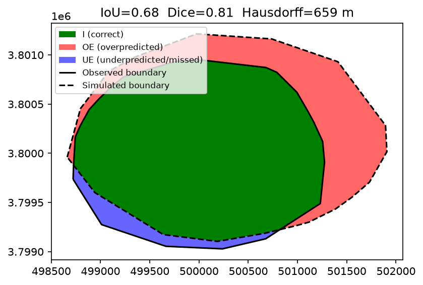
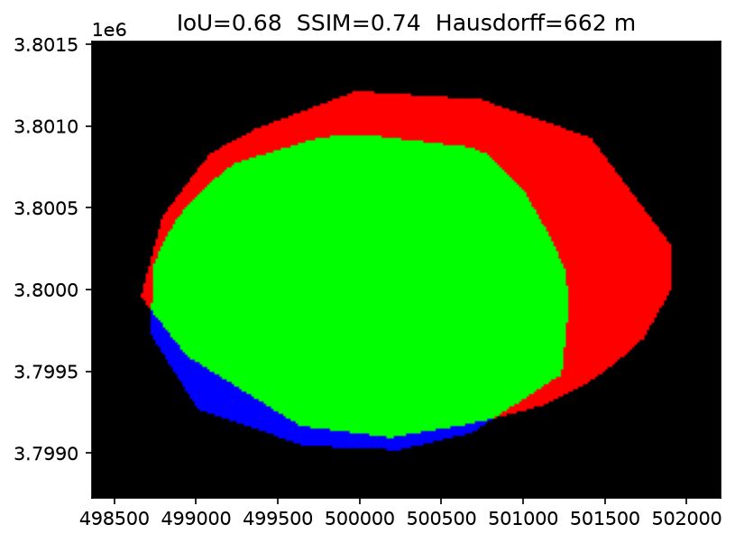

# Fire Spread Indices (FSI)

A Python library and benchmark reference for evaluating wildfire spread simulations against observed fire perimeters. It supports both **vector** perimeters (Shapefile, GeoJSON, GeoPackage, `GeoDataFrame`) and **raster** grids (GeoTIFF, NumPy 2D arrays).


---

## 🌟 Features

- **Vector & Raster Support**: Calculate spatial evaluation metrics analytically using polygon overlays (`shapely` / `geopandas`) or numerically via binary/continuous raster grids (`rasterio` / `numpy`).
- **Comprehensive Spatial Metrics**:
  - **Overall Agreement**: IoU (Jaccard), Sørensen-Dice ($F_1$), Shape Deviation Index (SDI), Area Difference Index (ADI), Structural Similarity Index (SSIM).
  - **Overprediction / Specificity**: Precision (PPV), Partial SDI Over ($SDI_{over}$), Partial ADI Over ($ADI_{over}$), Fire Area / Expansion Ratio.
  - **Underprediction / Sensitivity**: Recall (TPR / Sensitivity), Partial SDI Under ($SDI_{under}$), Partial ADI Under ($ADI_{under}$).
  - **Boundary Distance**: Hausdorff distance ($d_H$) for worst-case perimeter mismatch.
- **Convenient Unified API**: Automatic modality inference (`evaluate_fire_perimeters`) with formatted terminal reports, dictionary access, and pandas Series conversion.

---

## 📐 Metrics Overview

The metrics follow standard notation comparing observed fire area $F$ and simulated fire area $S$:
* $F$: Reference / Observed fire area ($F = I + UE$)
* $S$: Simulated / Predicted fire area ($S = I + OE$)
* $I$: Intersection area (Correctly predicted burned area)
* $OE$: Overestimated area (False alarms / Overprediction)
* $UE$: Underestimated area (Missed burned area / Underprediction)

| Metric | Formula / Meaning | Key | Vector | Raster | Best Use Case | Reference / Source |
|---|---|:---:|:---:|:---:|---|---|
| **Intersection over Union (IoU)** | $\frac{I}{S \cup F} = \frac{I}{I + OE + UE}$ | `IoU` | ✅ | ✅ | Standard benchmark for ranking spread models. | Jaccard (1912) |
| **Sørensen–Dice / $F_1$** | $\frac{2I}{F + S} = \frac{2I}{2I + OE + UE}$ | `Dice` | ✅ | ✅ | Multi-fire validation suites (less punishing on small fires). | Sørensen (1948) / Dice (1945); Duff et al. (2016) |
| **Shape Deviation Index (SDI)** | $\frac{OE + UE}{F}$ | `SDI` | ✅ | ✅ | Scale-independent total error normalized by observed fire size. | Cui & Perera (2010) |
| **Area Difference Index (ADI)** | $\frac{OE + UE}{I}$ | `ADI` | ✅ | ✅ | Stress test for catastrophic ignition/forcing failures ($I \to 0$). | Duff et al. (2016) |
| **Precision / PPV** | $\frac{I}{S} = \frac{I}{I + OE}$ | `Precision` | ✅ | ✅ | Cost assessments of false alarms (evacuations, containment lines). | Duff et al. (2016) |
| **Recall / TPR** | $\frac{I}{F} = \frac{I}{I + UE}$ | `Recall` | ✅ | ✅ | Life-safety early-warning validation (penalizes missed fire). | Duff et al. (2016) |
| **Partial SDI (Over / Under)** | $\frac{OE}{F}$, $\frac{UE}{F}$ | `SDI_over`, `SDI_under` | ✅ | ✅ | Directional model bias across different fire sizes. | Cui & Perera (2010) |
| **Partial ADI (Over / Under)** | $\frac{OE}{I}$, $\frac{UE}{I}$ | `ADI_over`, `ADI_under` | ✅ | ✅ | Diagnostic for runaway growth or missed containment breach. | Duff et al. (2016) |
| **Expansion Ratio** | $\frac{S}{F}$ | `ExpansionRatio` | ✅ | ✅ | Macro-scale burned-area sanity check (e.g. seasonal budgets). | General fire behavior ratio |
| **Hausdorff Distance** | $\max(d(S \to F), d(F \to S))$ | `Hausdorff` | ✅ | ✅ | Worst-case operational boundary error (front placement). | Hausdorff metric (boundary distance) |
| **SSIM** | Continuous field similarity | `SSIM` | ❌ | ✅ | Continuous raster fields (arrival-time isochrones, ROS grids). | Wang et al. (2004) |

For detailed mathematical formulations, theoretical motivations, and metric discussions, see [FSI.md](./FSI.md).

---

## 🚀 Installation

Ensure you have Python 3.9+ installed. Install the required spatial and scientific libraries:

```bash
pip install numpy pandas geopandas shapely rasterio scipy scikit-image matplotlib
```

---

## 💻 Quick Start

### 1. Unified Interface

```python
from fsi_metrics import evaluate_fire_perimeters

# Automatically infers vector vs. raster based on file path or object type
result = evaluate_fire_perimeters("observed.geojson", "simulated.geojson")

# Print formatted summary table
print(result)

# Access individual metrics
print(f"IoU: {result.values['IoU']:.3f}")
print(f"Hausdorff distance: {result.values['Hausdorff']:.1f} m")

# Export as a pandas Series (e.g., for multi-fire batch runs)
series = result.to_series()
```

### 2. Vector Evaluation

```python
import geopandas as gpd
from fsi_metrics import evaluate_vector

obs_gdf = gpd.read_file("observed_perimeter.shp")
sim_gdf = gpd.read_file("simulated_perimeter.shp")

# densify_distance (meters) samples boundary coordinates for accurate Hausdorff distance calculation
result = evaluate_vector(obs_gdf, sim_gdf, densify_distance=25.0)

# Decomposed geometry components are available for plotting
# result.geoms contains: "I", "OE", "UE", "F", "S"
```

### 3. Raster Evaluation

```python
from fsi_metrics import evaluate_raster

# Binary or continuous rasters (e.g., GeoTIFF)
result = evaluate_raster("observed_arrival_time.tif", "simulated_arrival_time.tif", ssim=True)
print(f"SSIM: {result.values['SSIM']:.3f}")
```

---

## 📊 Visual Examples

Run [`example_fsi.py`](./example_fsi.py) to generate synthetic comparisons for vector and raster evaluations:

```bash
python example_fsi.py
```

### Vector Perimeter Comparison
Decomposition into Intersection ($I$, green), Overestimated ($OE$, red), and Underestimated ($UE$, blue):



### Continuous Raster Field Comparison (SSIM & Differences)
Continuous arrival-time / rate-of-spread evaluation and pixel classification:



---

## 📁 Repository Structure

```text
.
├── FSI.md                         # Detailed metric formulas, literature context, and guidelines
├── README.md                      # Project overview and quickstart documentation
├── fsi_metrics.py                 # Core evaluation library (vector & raster metrics)
├── example_fsi.py                 # Example script evaluating synthetic fire perimeters
├── figure1_schematic.py           # Script generating the schematic diagram
├── figure1_schematic.png          # Schematic figure of spatial metric definitions
├── example_vector_comparison.png  # Sample visualization of vector metric components
└── example_raster_comparison.png  # Sample visualization of raster metric evaluation
```

---

## 📚 References

The indices and evaluation methods in this project are based on the following literature:

1. **Area Difference Index (ADI), Sørensen–Dice ($F_1$), Precision, & Recall**:
   * Duff, T. J., Chong, D. M., & Tolhurst, K. G. (2016). *Indices for the evaluation of wildfire spread simulations using contemporaneous predictions and observations of burnt area*. **Environmental Modelling & Software**, 83, 276–285. [https://doi.org/10.1016/j.envsoft.2016.05.018](https://doi.org/10.1016/j.envsoft.2016.05.018)
   * *Contribution*: Establishes the Area Difference Index ($ADI = \frac{OE + UE}{I}$) to quantify size mismatch relative to matched burned area, decomposes errors into over- and under-prediction ($ADI_{over}, ADI_{under}$), and adopts classification statistics ($F_1$, precision, recall) for time-stamped perimeter evaluation.

2. **Structural Similarity Index (SSIM)**:
   * Wang, Z., Bovik, A. C., Sheikh, H. R., & Simoncelli, E. P. (2004). *Image quality assessment: from error visibility to structural similarity*. **IEEE Transactions on Image Processing**, 13(4), 600–612. [https://doi.org/10.1109/TIP.2003.819861](https://doi.org/10.1109/TIP.2003.819861)
   * *Contribution*: Used for continuous raster comparisons (such as fire arrival-time isochrones and rate-of-spread fields), capturing structural correlations, texture, and gradients across local sliding windows rather than solely pixel-wise binary overlap.

3. **Hausdorff Distance ($d_H$)**:
   * Hausdorff, F. (1914). *Grundzüge der Mengenlehre*. Veit & Comp, Leipzig. (Implemented via `scipy.spatial.distance.directed_hausdorff`).
   * *Contribution*: Measures the maximum spatial separation distance between observed ($\partial F$) and simulated ($\partial S$) perimeter boundaries ($\max(d(S \to F), d(F \to S))$), capturing worst-case active fire front displacement essential for operational safety.

---

## 📄 License

MIT License. Feel free to use and adapt in your wildfire modeling and benchmarking pipelines.
